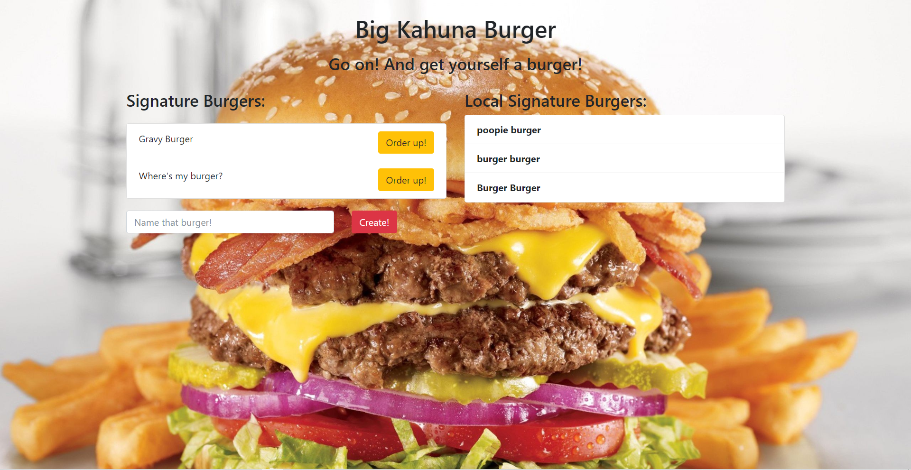

# Big Kahuna Burger

**Big Kahuna Burger** is a full-stack web application that uses the Sequelize ORM library. The app provides users with the ability to customize a burger that will appear on a list of signature burgers. Once consumed, the burger appears on the list of custom-signature burgers.

## High Level Overview

The application implements CRUD methods via the Sequelize ORM library. This app utilizes models that GET and POST data using validation checks. The Sequelize ORM allows the application to make assocaitions between data tables. Sequelize is also implemented for the configuration of the application for deployment on Heroku.

## Give it a shot
[Link to Deployed Link] (https://big-kahuna-burger1.herokuapp.com/)

### Heroku Deployment 

**Big Kahuna Burger** is deployed through Heroku which provides data persistence and the implementation of the MySQL configured **JAWSDB**. 

### MySQL

MySQL is a relational database that is utilized for storing all of the data specific to the implementation of this application. 

### Express

Express servers rely on JavaScript routing files to handle the HTML and API calls that are utilized in this application. 

### Sequelize ORM Library

Sequelize provides the application with a boost in efficiency and data management capabilities. Sequelize utilizes object models for structuring database tables relevant to each data type. This enables the application to make fluid associations between database tables. 
